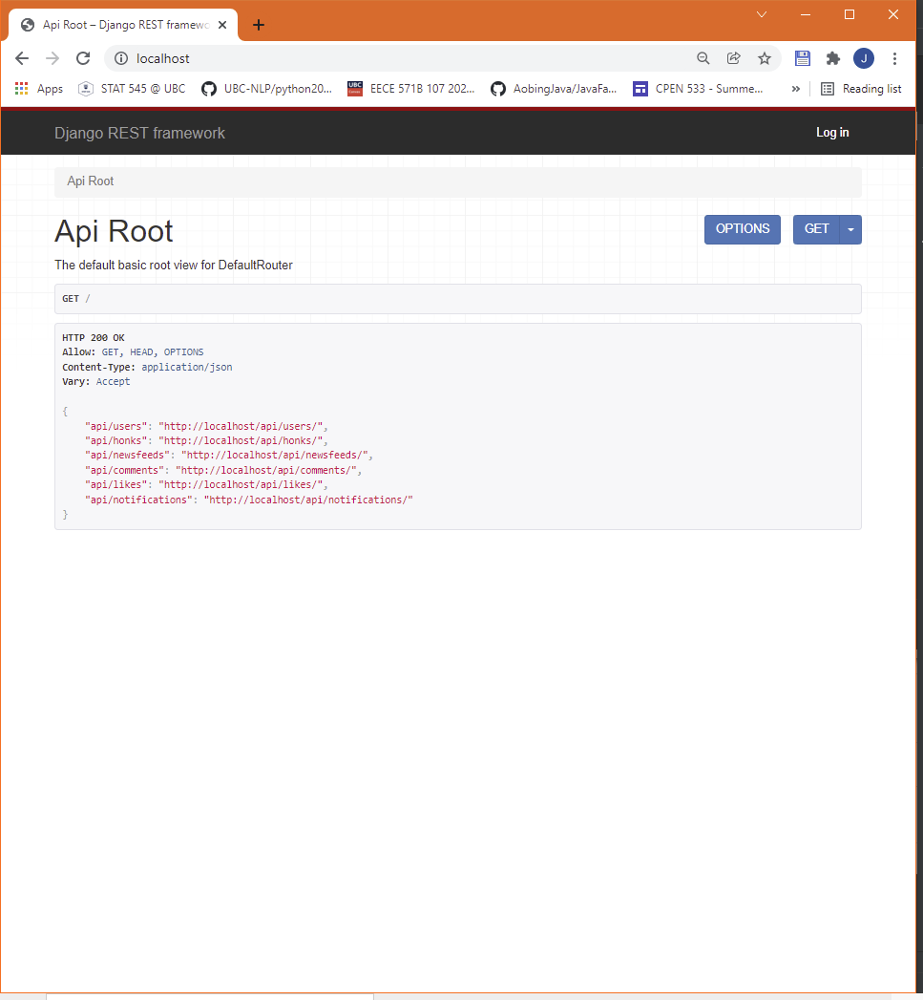
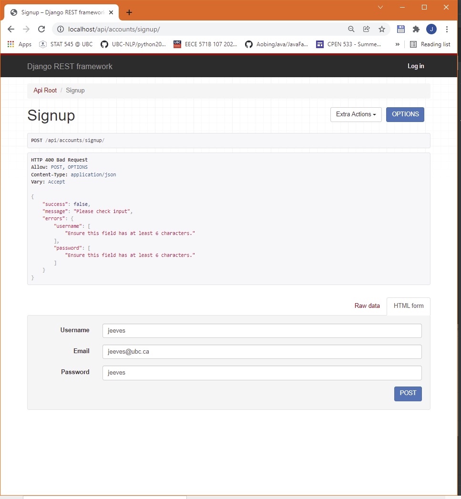
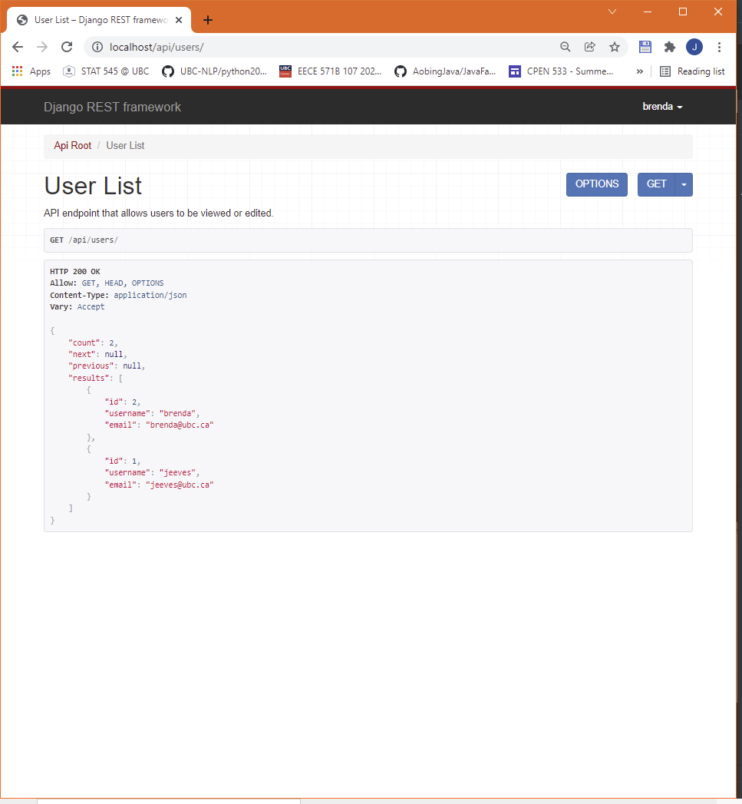
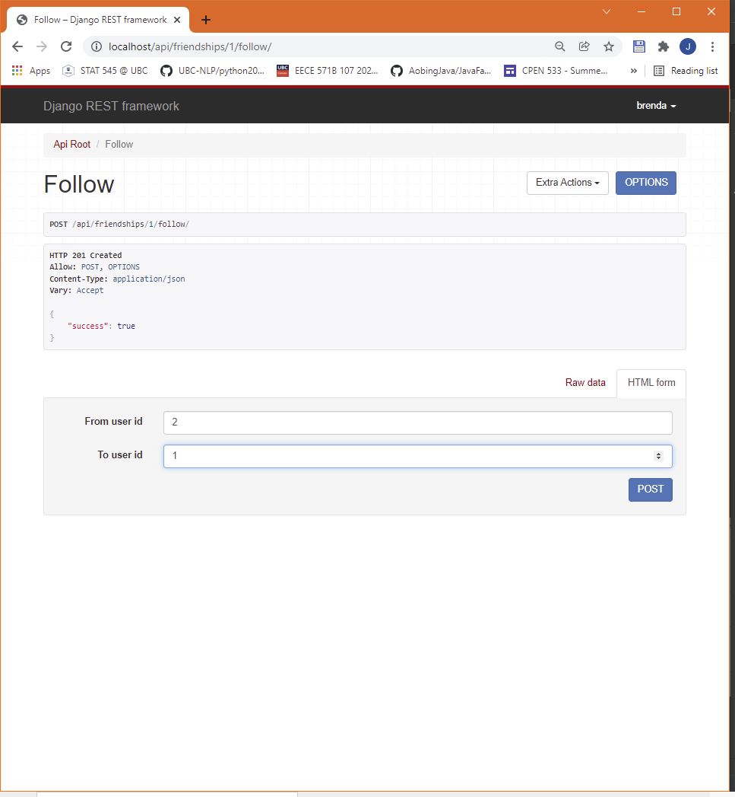
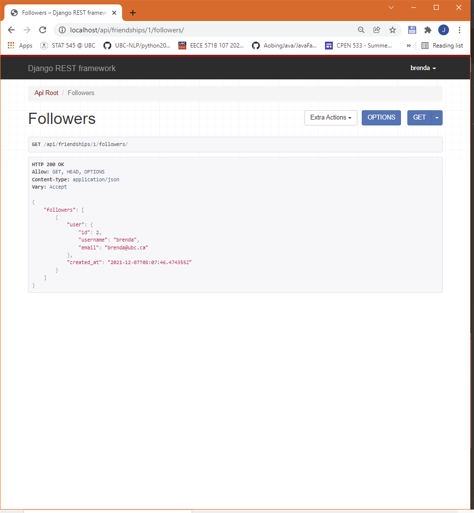
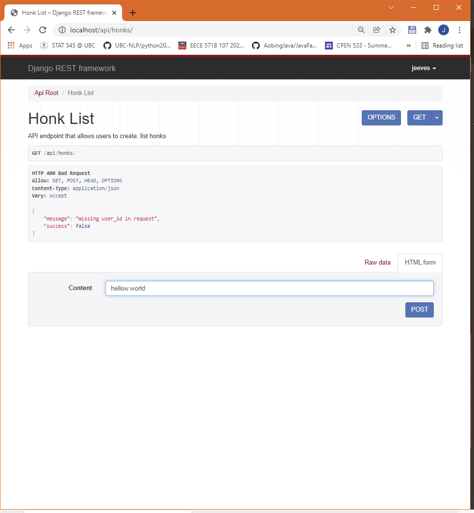
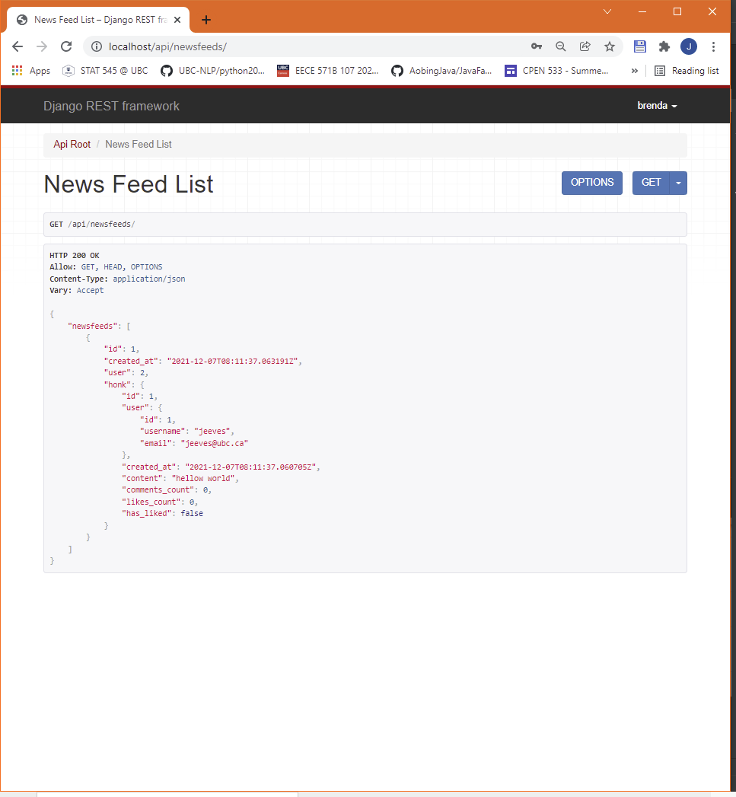
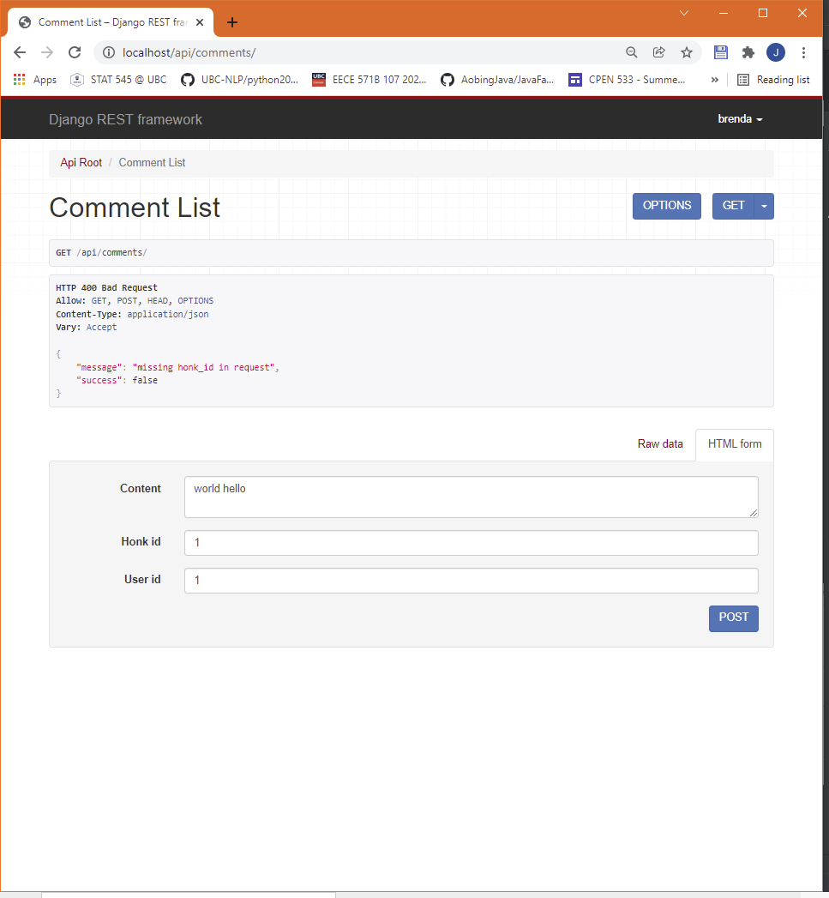
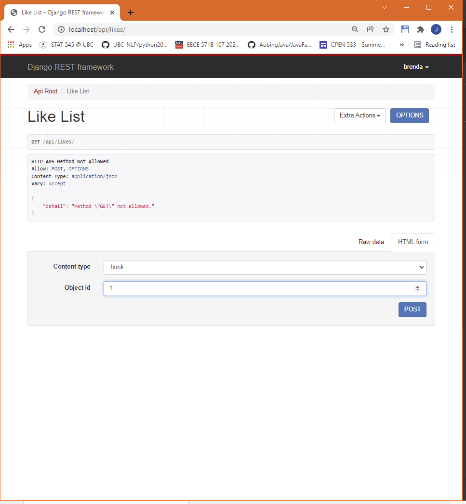

# Honker

## Deployment

### Clone this Repository

- This repo contains all the files needed to run this project. Please clone it to you local machine.
- The file path for this project should be like `<PATH-TO-FILE>/honker`.

### Download Vagrant & VirtualBox

- Download and install Vagrant from [here](https://www.vagrantup.com/downloads) based on the OS of you machine.

- Download the mirror file from [here](https://app.vagrantup.com/hashicorp/boxes/bionic64). Please select `virtualbox Hosted by Vagrant Cloud (494 MB)`.

- You will get a file with a hexadecimal string as its filename. Please rename this file as `bionic64.box`.
- On you command line, first forward to the location of `bionic64.box`, and then type `vagrant box add hashicorp/bionic64.box` in your command line.
- Type `vagrant box list` in your command line to check if the mirror has already added. You should be able to see `hashicorp/bionic64 (virtualbox, 0)` or something similar.

- You will need **VirtualBox** to run the virtual machine. Download VirtualBox from [here](https://www.virtualbox.org/wiki/Downloads) based on the OS of you machine.

### Config Vagrant

- You will need 4 files to setup the virtual environment on Vagrant, which are:
  - `VagrantFile`: main config file to setup the virtual environment on Vagrant
  - `requirements.txt`: all the Python libraries needed for this project
  - `provision.sh`: a shell script in order to initialize the virtual environment
  - `mysql-apt_config_0.8.15-1_all.deb`: config file for MySQL. This is a web application, MySQL is the main database in our project.
- These 4 files are contained in the root directory of this project. You do not need to download them from somewhere else.
- All the files are well configured except for `VagrantFile`. Uncomment line 51 and modify it to `config.vm.synced_folder "<PATH-TO-FILE>/honker", "/home/vagrant/honker"` . The first path is the project location on your host machine, while the second path is the project location on the virtual machine. This will setup a link between host and virtual machines.

### Start Vagrant

- Type `vagrant up` on your command line. This will take a while to complete.
- Type `vagrant ssh` to switch to the command line of **Vagrant**. You can see the project in `/home/vagrant/honker`.
- You can also see a virtual machine running in **VirtualBox** with name of `honker`.
- Type `python --version` you can see `Python 3.6.9`.
- Type `python -m django --version` you can see `3.1.3`.

### Start Server

- In Vagrant command line, type `python manage.py test` to run unit tests of this project.
- In Vagrant command line, type `python manage.py runserver 0.0.0.0:8000` to start the server.
- In your browser, type `localhost` and you can see the home page of Django web framework.


## Approach

### Django REST Framework


### REST API
In almost all modern web applications, front-end and back-end are completely separated.
Front-end, mostly implemented using HTML, CSS, and JavaScript, interacts with clients directly
by providing interactive operations and animation effects. Back-end, on the other hand, interacts
with data and database directly. Front-end and back-end are implemented in different programming
languages in most scenarios. Therefore, they must be connected with some unified interface, which is
API (application programming interface).

When you type in a URL, or click a button in your browser, what you actually do is using
the front-end of the web application to call the API. In the meantime, the back-end will
be able to detect the calling and respond to it. After interact with the database, back-end
will also call API to transfer the result to front-end, then front-end can present the result
to the client. In this project, since we do not have a front-end, we call API in back-end 
directly instead of using front-end to do that. The working principle is the same but not
user-friendly at all.

API is completely defined by developers so the style must be various. REST API is the most popular
style in modern web applications. REST, Representational State Transfer, aims to design the
format of the API to make it as intuitive as possible. In other words, you see the API, you
know what it is trying to do immediately.

There are 2 most important principles for REST API:
- Use plurality: `/api/accounts/` is correct while `/api/account/` is not
- Do not contain any verb in the API, use nouns only: `/api/updateComments/` is wrong

In this project, we fully obey the REST principles for development and further extension. 


### Serializer
Serializer is one of the most important components of a Django project. In memory, data can
be held in various data structures such as array, list, tree, dictionary, or graph. However,
in network transfer, data can only be processed in serialized data stream. In this project,
every model is an extension of the serializer of Django REST Framework, and each of them has 
its own serializer to serialize and de-serialize the data defined by the model. Example code
is shown as below:
```python
class NewsFeedSerializer(serializers.ModelSerializer):
    honk = HonkSerializer()

    class Meta:
        model = NewsFeed
        fields = ('id', 'created_at', 'user', 'honk')
```

### Model & View Set
Model and View set are also important to Django project. As mentioned above, back-end
directly interacts with database, which means it needs to perform operations 
(INSERT/DELETE/SELECT/UPDATE) on tables. Django REST Framework provides interfaces so that
developers do not have to create the table manually. Instead, developers only need to define
the fields in model, and the tables will be automatically generated after running
`python manage.py migrate` in command line.

## Usage
Since for now we have only implemented the back-end (pure Python part), all the operations
are supposed to be done by calling API. All the following user examples and screenshots are based on
**Django REST Framework**. The front-end part is going to be implemented in the future. Please
keep following this repo.

### Home Page
Type `localhost` in your browser to access the home page:

As it is shown in the screenshot, there is a list of APIs that can be clicked. However, most
of them needs login to access. Before first login, the client needs to register a Honker
account as other social media applications.

### Signup
Type `localhost/api/accounts/signup/` in your browser to access the signup page:

One needs `username`, `email`, and `password` to get a Honker account. If they are all valid,
an account will be generated and a unique ID will be assigned to this account. Here it will
be assigned as 1 for that this is the first account created in the database
(For the next few demos, it would be better to register another account). The system will
automatically log in to the account.

### Users
Type `localhost/api/users/` in your browser to check the user list:


### Follow
Type `localhost/api/1/follow/` in your browser to follow/unfollow other users:

Note we need to specify the user ID in the API to perform this operation.
Here we let user 2 to follow user 1 so that user 2 can receive the newsfeeds from user 1.

### Followings
Type `localhost/api/2/followings/` in your browser to check the followings list of a given user ID:


### Followers
Type `localhost/api/1/followers/` in your browser to check the followers list of a given user ID:


### Honk
Type `localhost/api/honks/` in your browser to draft a honk with content:


### NewsFeed
Type `localhost/api/newsfeeds/` in your browser to receive the newsfeed from users' friends:

Remember we let user 2 to follow user 1, so user 2 can receive the newsfeeds from user 1.
User 1 cannot receive any update from user 2 unless user 1 follows user 2 back.

### Comment
Type `localhost/api/comments/` in your browser to make comments for a honk:


### Like
Type `localhost/api/likes/` in your browser to like an original honk or its corresponding comments:
